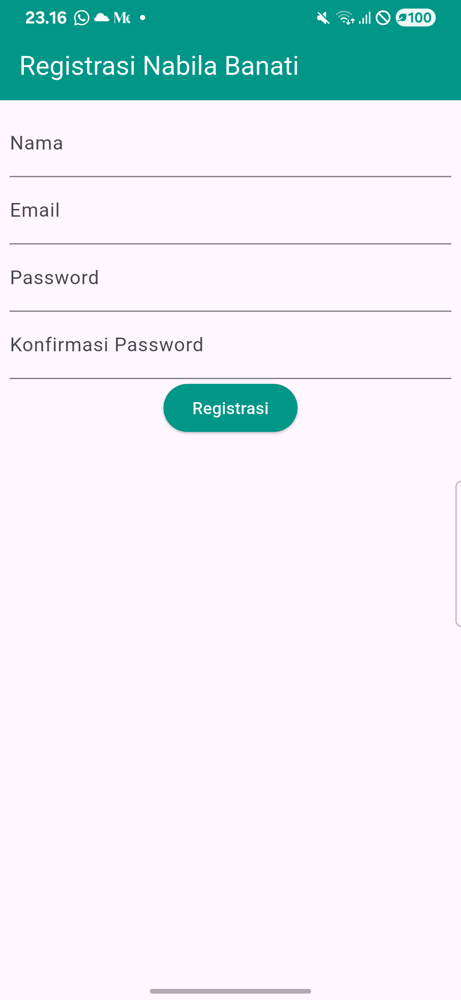
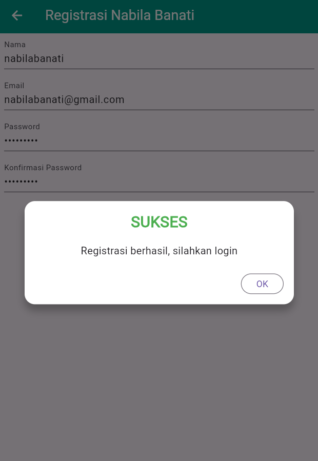
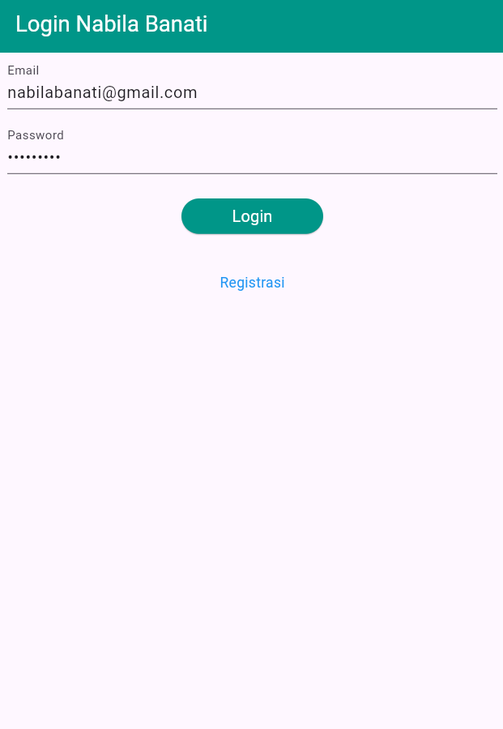
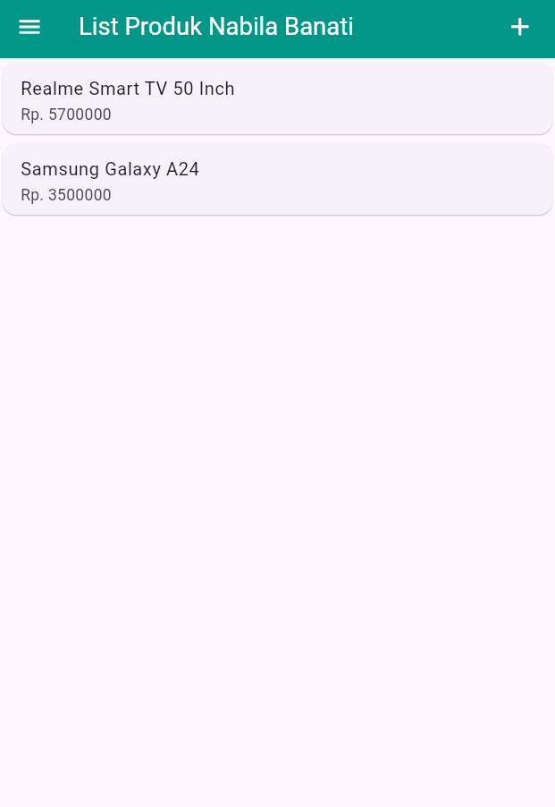
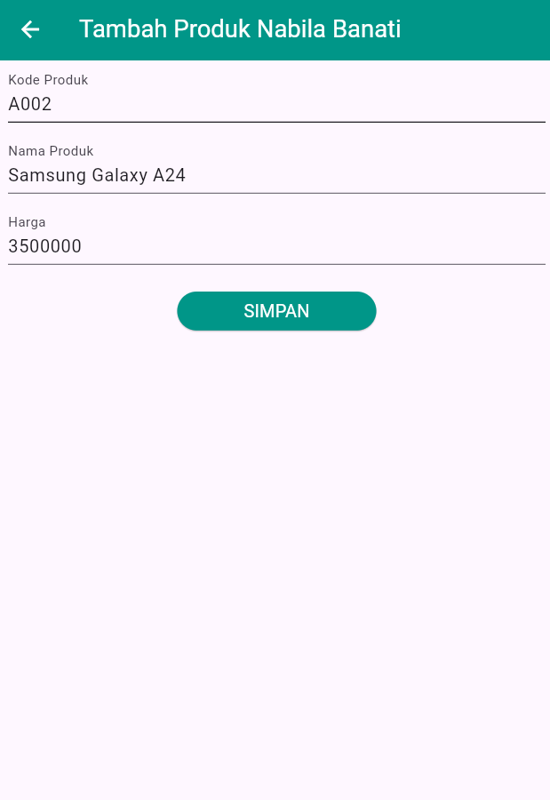
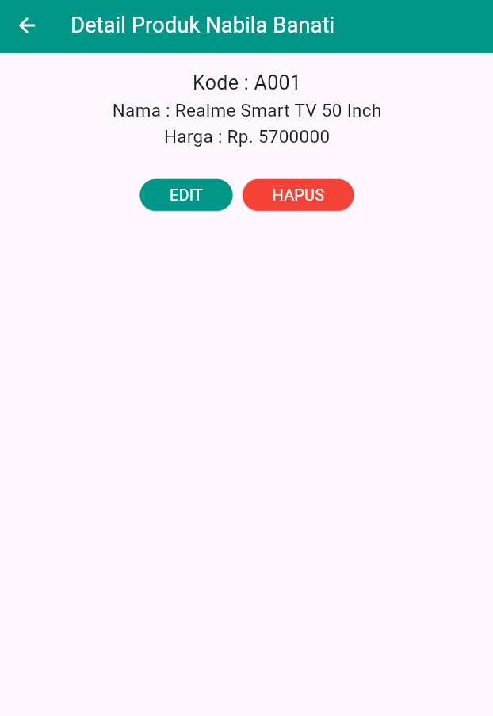
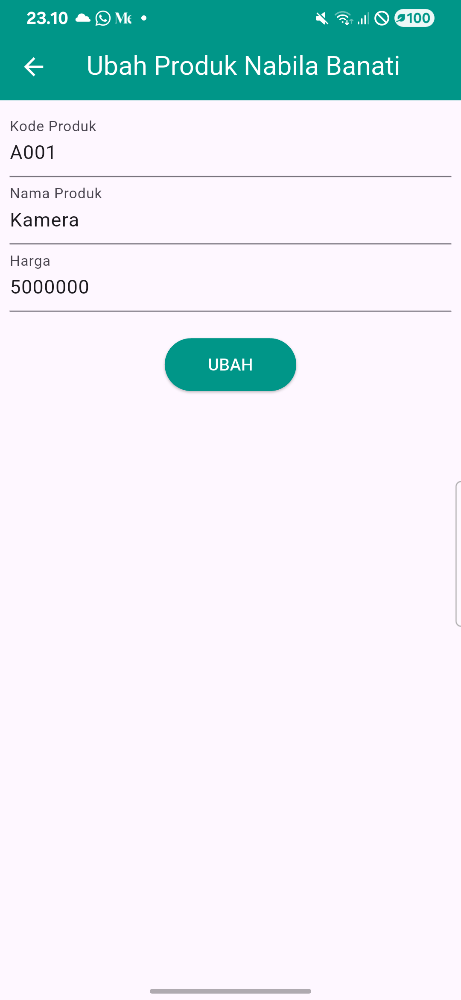
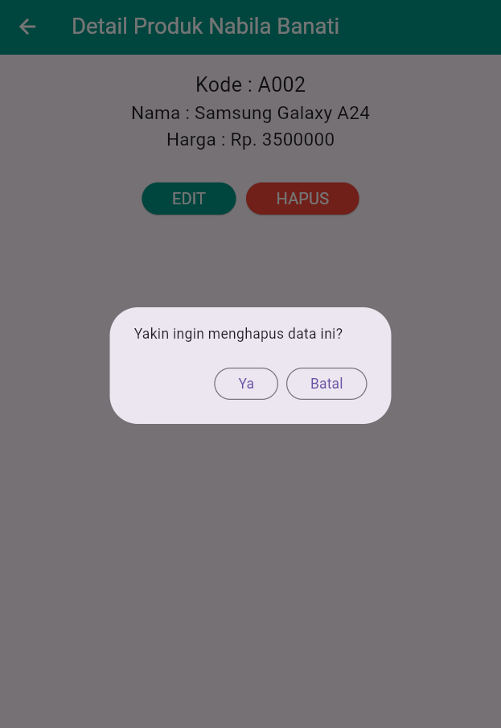
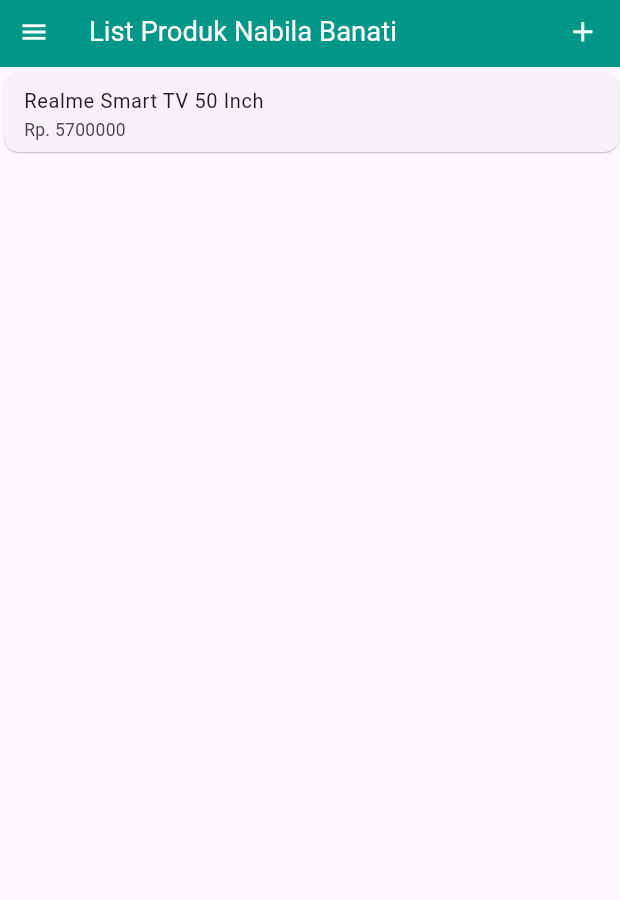
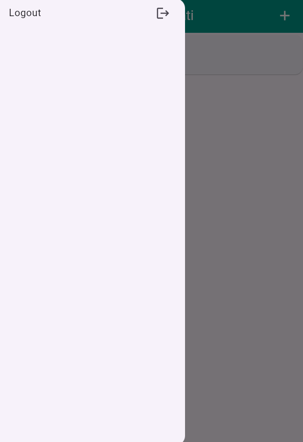

# Tugas 9 Praktikum Pemrograman Mobile 

## Identitas

Nama : Nabila Rizki Banati

NIM : H1D023086

Shift Awal : C

Shift Baru : D

## Deskripsi

Aplikasi TokoKita adalah aplikasi Flutter untuk manajemen produk toko, dengan fitur login, registrasi, dan CRUD (Create, Read, Update, Delete) produk. Aplikasi ini terintegrasi dengan API backend untuk menyimpan dan mengelola data produk secara real-time.

## Penjelasan Aplikasi

Aplikasi TokoKita dikembangkan menggunakan framework Flutter dan memanfaatkan API backend untuk mengelola data produk secara efisien. Pada dokumentasi ini, dijelaskan secara rinci setiap proses utama yang ada di aplikasi, mulai dari registrasi, login, hingga pengelolaan produk, lengkap dengan ilustrasi gambar dan potongan kode yang relevan.

---

## 1. Proses Registrasi

Proses registrasi memungkinkan pengguna baru untuk membuat akun dengan menyediakan informasi pribadi dan kredensial login mereka.

### a. Form Registrasi



Pengguna membuka halaman registrasi dan dihadapkan dengan form yang meminta empat informasi utama. Setiap field memiliki validasi khusus untuk memastikan data yang diinputkan sesuai dengan requirement sistem. Email harus dalam format yang valid dan belum terdaftar di sistem, password harus minimal 6 karakter untuk alasan keamanan, dan konfirmasi password harus sama dengan password yang diinputkan sebelumnya untuk menghindari kesalahan pengetikan.

### b. Popup Berhasil/Gagal Registrasi




Setelah pengguna mengklik tombol "Registrasi", sistem akan melakukan validasi pada semua field. Jika semua field valid dan proses registrasi berhasil, akan muncul dialog sukses yang menginformasikan pengguna bahwa registrasi telah selesai dan mengajak mereka untuk masuk dengan akun yang baru dibuat. Jika proses registrasi gagal (misalnya email sudah terdaftar di sistem), akan muncul dialog peringatan dengan pesan error.

**Kode Utama (dari `lib/ui/registrasi_page.dart`):**
```dart
void _submit() {
  _formKey.currentState!.save();
  setState(() {
    _isLoading = true;
  });
  RegistrasiBloc.registrasi(
    nama: _namaTextboxController.text,
    email: _emailTextboxController.text,
    password: _passwordTextboxController.text,
  ).then(
    (value) {
      showDialog(
        context: context,
        barrierDismissible: false,
        builder: (BuildContext context) => SuccessDialog(
          description: "Registrasi berhasil, silahkan login",
          okClick: () {
            Navigator.pop(context);
            Navigator.pop(context);
          },
        ),
      );
    },
    onError: (error) {
      showDialog(
        context: context,
        barrierDismissible: false,
        builder: (BuildContext context) => const WarningDialog(
          description: "Registrasi gagal, silahkan coba lagi",
        ),
      );
    },
  );
  setState(() {
    _isLoading = false;
  });
}
```

---

## 2. Proses Login

Proses login untuk autentikasi pengguna yang sudah memiliki akun di sistem. Login adalah langkah penting untuk mengamankan data pengguna dan memberikan akses ke fitur-fitur aplikasi yang membutuhkan autentikasi.

### a. Form Login



Pengguna membuka halaman login dan memasukkan email serta password mereka. Form ini memiliki validasi dasar untuk memastikan kedua field tidak kosong sebelum dikirim ke server. Terdapat juga link "Registrasi" di bawah form untuk pengguna yang belum memiliki akun, sehingga mereka dapat langsung membuat akun baru.

### b. Login Berhasil/Gagal

Setelah pengguna memasukkan email dan password kemudian mengklik tombol "Login", aplikasi akan mengirimkan request ke server API. Jika kredensial benar dan server merespons dengan code 200, sistem akan menyimpan token autentikasi di SharedPreferences dan secara otomatis mengarahkan pengguna ke halaman daftar produk. Jika login gagal, baik karena kredensial salah maupun error jaringan, akan muncul dialog peringatan yang memberitahu pengguna bahwa login gagal.

**Kode Utama (dari `lib/ui/login_page.dart`):**
```dart
void _submit() {
  _formKey.currentState!.save();
  setState(() {
    _isLoading = true;
  });
  LoginBloc.login(
    email: _emailTextboxController.text,
    password: _passwordTextboxController.text,
  ).then(
    (value) async {
      if (value.code == 200) {
        await UserInfo().setToken(value.token.toString());
        if (value.userID != null) {
          await UserInfo().setUserID(int.parse(value.userID.toString()));
        }
        Navigator.pushReplacement(
          context,
          MaterialPageRoute(builder: (context) => const ProdukPage()),
        );
      } else {
        showDialog(
          context: context,
          barrierDismissible: false,
          builder: (BuildContext context) => const WarningDialog(
            description: "Login gagal, silahkan coba lagi",
          ),
        );
      }
    },
    onError: (error) {
      print(error);
      showDialog(
        context: context,
        barrierDismissible: false,
        builder: (BuildContext context) => const WarningDialog(
          description: "Login gagal, silahkan coba lagi",
        ),
      );
    },
  );
  setState(() {
    _isLoading = false;
  });
}
```

---

## 3. Proses List Produk

Halaman daftar produk adalah layar utama aplikasi setelah pengguna berhasil melakukan login. Halaman ini menampilkan semua produk yang telah ditambahkan ke sistem dalam bentuk list yang mudah dipahami.



Halaman ini menampilkan list produk dalam bentuk card yang berisi informasi nama dan harga setiap produk. Di bagian top-right AppBar terdapat ikon plus (+) yang dapat ditekan untuk menambahkan produk baru, sementara di sebelah kiri terdapat drawer menu yang menyediakan opsi untuk logout. Setiap item produk di list dapat diklik untuk melihat detail lengkapnya.

**Kode Utama (dari `lib/ui/produk_page.dart`):**
```dart
body: FutureBuilder<List>(
  future: ProdukBloc.getProduks(),
  builder: (context, snapshot) {
    if (snapshot.hasError) print(snapshot.error);
    return snapshot.hasData
        ? ListProduk(list: snapshot.data)
        : const Center(child: CircularProgressIndicator());
  },
),
```

---

## 4. Proses Tambah Produk

Proses penambahan produk baru memungkinkan pengguna untuk menambahkan item produk baru ke dalam sistem toko mereka dengan informasi lengkap seperti kode, nama, dan harga.

### a. Form Tambah Produk



Pengguna dapat membuka halaman form tambah produk dengan menekan tombol plus (+) di halaman list produk. Form ini berisi tiga field wajib yang harus diisi yaitu kode produk sebagai identitas unik produk, nama produk untuk deskripsi produk, dan harga produk dalam format angka. Setiap field memiliki validasi untuk memastikan data yang diinputkan lengkap dan valid sebelum dapat disimpan.

**Kode Utama (dari `lib/ui/produk_form.dart`):**
```dart
simpan() {
  setState(() {
    _isLoading = true;
  });
  Produk createProduk = Produk(id: null);
  createProduk.kodeProduk = _kodeProdukTextboxController.text;
  createProduk.namaProduk = _namaProdukTextboxController.text;
  createProduk.hargaProduk = int.parse(_hargaProdukTextboxController.text);
  ProdukBloc.addProduk(produk: createProduk).then(
    (value) {
      Navigator.of(context).push(
        MaterialPageRoute(
          builder: (BuildContext context) => const ProdukPage(),
        ),
      );
    },
    onError: (error) {
      showDialog(
        context: context,
        builder: (BuildContext context) => const WarningDialog(
          description: "Simpan gagal, silahkan coba lagi",
        ),
      );
    },
  );
  setState(() {
    _isLoading = false;
  });
}
```

---

## 5. Proses Detail Produk

Halaman detail produk menampilkan informasi lengkap dari satu produk yang dipilih oleh pengguna, beserta opsi-opsi yang tersedia untuk memodifikasi atau menghapus produk tersebut.



Halaman detail produk menampilkan informasi lengkap sebuah produk meliputi kode produk, nama produk, dan harga produk dalam format yang mudah dibaca. Di bagian bawah informasi produk terdapat dua tombol aksi: tombol EDIT berwarna teal yang akan membawa pengguna ke form edit, dan tombol HAPUS berwarna merah yang akan menampilkan dialog konfirmasi sebelum produk dihapus.

**Kode Utama (dari `lib/ui/produk_detail.dart`):**
```dart
body: Center(
  child: Column(
    mainAxisAlignment: MainAxisAlignment.center,
    children: [
      Text(
        "Kode : ${widget.produk!.kodeProduk}",
        style: const TextStyle(fontSize: 20.0),
      ),
      const SizedBox(height: 12),
      Text(
        "Nama : ${widget.produk!.namaProduk}",
        style: const TextStyle(fontSize: 18.0),
      ),
      const SizedBox(height: 12),
      Text(
        "Harga : Rp. ${widget.produk!.hargaProduk.toString()}",
        style: const TextStyle(fontSize: 18.0),
      ),
      const SizedBox(height: 20),
      _tombolHapusEdit(),
    ],
  ),
),
```

---

## 6. Proses Ubah Produk

Proses pengubahan data produk memungkinkan pengguna untuk memperbarui informasi produk yang sudah ada di dalam sistem dengan data baru.

### a. Form Ubah Produk



Pengguna dapat mengakses halaman form ubah produk dengan mengklik tombol EDIT di halaman detail produk. Form ubah memiliki struktur yang sama dengan form tambah produk, namun semua field sudah terisi otomatis dengan data produk yang sebelumnya. Pengguna dapat mengubah salah satu atau beberapa field sesuai kebutuhan, dan tombol submit akan berubah teks menjadi "UBAH" untuk menunjukkan bahwa mode yang sedang aktif adalah mode edit.

**Kode Utama (dari `lib/ui/produk_form.dart`):**
```dart
ubah() {
  setState(() {
    _isLoading = true;
  });
  Produk updateProduk = Produk(id: widget.produk!.id!);
  updateProduk.kodeProduk = _kodeProdukTextboxController.text;
  updateProduk.namaProduk = _namaProdukTextboxController.text;
  updateProduk.hargaProduk = int.parse(_hargaProdukTextboxController.text);
  ProdukBloc.updateProduk(produk: updateProduk).then(
    (value) {
      Navigator.of(context).push(
        MaterialPageRoute(
          builder: (BuildContext context) => const ProdukPage(),
        ),
      );
    },
    onError: (error) {
      showDialog(
        context: context,
        builder: (BuildContext context) => const WarningDialog(
          description: "Permintaan ubah data gagal, silahkan coba lagi",
        ),
      );
    },
  );
  setState(() {
    _isLoading = false;
  });
}
```

---

## 7. Proses Hapus Produk

Proses penghapusan produk memungkinkan pengguna untuk menghilangkan produk dari sistem secara permanen dengan konfirmasi terlebih dahulu.

### a. Konfirmasi Hapus



Pengguna dapat menghapus produk dengan mengklik tombol HAPUS di halaman detail produk. Sebelum produk dihapus secara permanen, sistem akan menampilkan dialog konfirmasi yang bertanya "Yakin ingin menghapus data ini?" untuk memastikan pengguna benar-benar ingin menghapus produk tersebut.

### b. Hapus Berhasil



Jika pengguna mengklik "Ya" pada dialog konfirmasi, sistem akan mengirimkan request delete ke API backend. Jika request berhasil, produk akan dihapus dari database dan pengguna akan dikembalikan ke halaman list produk, dimana produk yang dihapus sudah tidak akan muncul lagi.

**Kode Utama (dari `lib/ui/produk_detail.dart`):**
```dart
void confirmHapus() {
  AlertDialog alertDialog = AlertDialog(
    content: const Text("Yakin ingin menghapus data ini?"),
    actions: [
      OutlinedButton(
        child: const Text("Ya"),
        onPressed: () {
          Navigator.pop(context);
          ProdukBloc.deleteProduk(id: int.parse(widget.produk!.id!))
              .then((value) {
                Navigator.of(context).push(
                  MaterialPageRoute(builder: (context) => const ProdukPage()),
                );
              })
              .catchError((error) {
                showDialog(
                  context: context,
                  builder: (BuildContext context) => const WarningDialog(
                    description: "Hapus gagal, silahkan coba lagi",
                  ),
                );
              });
        },
      ),
      OutlinedButton(
        child: const Text("Batal"),
        onPressed: () => Navigator.pop(context),
      ),
    ],
  );
  showDialog(builder: (context) => alertDialog, context: context);
}
```

---

## 8. Proses Logout

Proses logout memungkinkan pengguna untuk keluar dari aplikasi dan kembali ke halaman login untuk keamanan data pribadi mereka.



Dari halaman list produk, pengguna dapat membuka drawer menu dengan mengklik ikon hamburger di pojok kiri atas. Di dalam drawer terdapat opsi "Logout" yang dapat ditekan untuk keluar dari aplikasi. Setelah mengklik Logout, sistem akan menghapus token autentikasi dari penyimpanan lokal dan mengarahkan pengguna kembali ke halaman login, sehingga pengguna harus login kembali untuk mengakses fitur-fitur aplikasi.

**Kode Utama (dari `lib/ui/produk_page.dart`):**
```dart
ListTile(
  title: const Text('Logout'),
  trailing: const Icon(Icons.logout),
  onTap: () async {
    await LogoutBloc.logout().then(
      (value) => {
        Navigator.of(context).pushAndRemoveUntil(
          MaterialPageRoute(builder: (context) => LoginPage()),
          (route) => false,
        ),
      },
    );
  },
),
```
