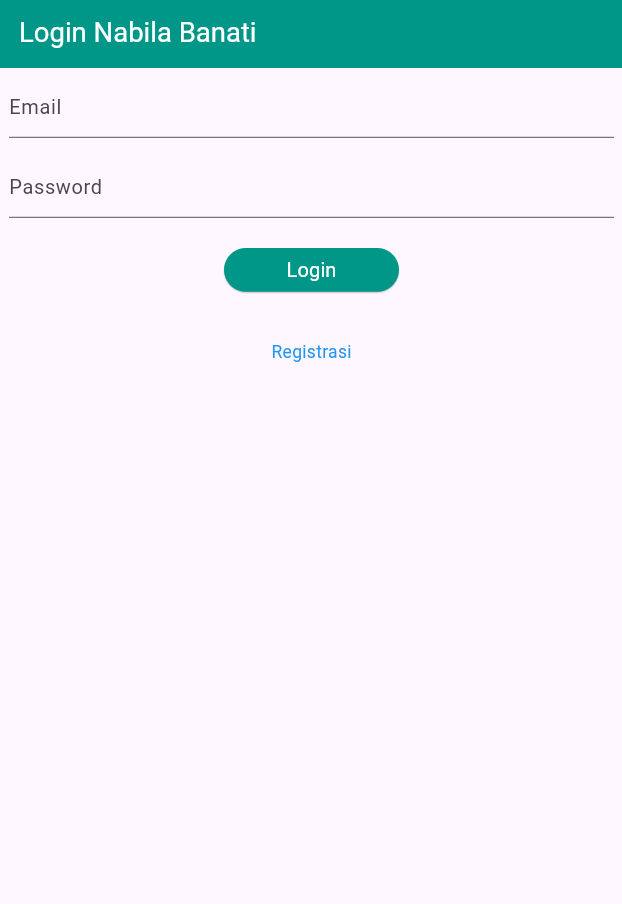

# Tugas 8 Praktikum Pemrograman Mobile 

## Identitas

Nama : Nabila Rizki Banati

NIM : H1D023086

Shift Awal : C

Shift Baru : D

## Screenshot Aplikasi

### 1. Halaman Login


Halaman login merupakan pintu masuk ke aplikasi dimana pengguna dapat memasukkan email dan password mereka untuk autentikasi. Pengguna yang belum memiliki akun dapat mengklik link "Registrasi" untuk membuat akun baru. Setelah mengisi form dan validasi berhasil, pengguna akan masuk ke halaman daftar produk.

### 2. Halaman Registrasi


Halaman registrasi memungkinkan pengguna baru untuk membuat akun dengan mengisi nama lengkap, email, password, dan konfirmasi password. Setiap field memiliki validasi ketat untuk memastikan data yang diinputkan sesuai dengan requirement. Setelah registrasi berhasil, pengguna akan diarahkan kembali ke halaman login untuk melakukan autentikasi.

### 3. Halaman Daftar Produk


Halaman daftar produk merupakan layar utama aplikasi setelah pengguna berhasil login. Halaman ini menampilkan semua produk yang tersedia dalam bentuk kartu (card) dengan informasi nama dan harga produk. Di pojok kanan atas terdapat tombol tambah (+) untuk menambahkan produk baru. Pengguna dapat mengetuk salah satu produk untuk melihat detail lengkapnya, atau membuka drawer di samping untuk mengakses menu tambahan seperti logout.

### 4. Halaman Form Produk


Halaman form produk digunakan untuk menambah produk baru dengan mengisi tiga field wajib yaitu kode produk, nama produk, dan harga produk. Form ini dapat diakses dari tombol tambah di halaman daftar produk. Judul dan tombol pada halaman ini akan berubah tergantung mode penggunaan.


Ketika mengedit produk yang sudah ada, halaman form akan terisi dengan data produk sebelumnya dan tombol submit akan berubah teks menjadi "UBAH". Mode edit dapat diakses melalui tombol edit di halaman detail produk. Setelah submit, pengguna akan kembali ke daftar produk dengan data yang telah diperbarui.

### 5. Halaman Detail Produk


Halaman detail produk menampilkan informasi lengkap tentang satu produk yang dipilih, mencakup kode produk, nama produk, dan harganya. Di bawah informasi tersebut terdapat dua tombol aksi yaitu tombol EDIT berwarna teal yang akan membawa pengguna ke form edit, dan tombol HAPUS berwarna merah yang akan menampilkan dialog konfirmasi sebelum menghapus produk dari sistem.


---

## Model

Model merupakan lapisan data yang mendefinisikan struktur informasi dalam aplikasi. Setiap model menyediakan method untuk konversi data dari format eksternal (JSON) menjadi objek Dart yang dapat digunakan.

### 1. Model Login (`lib/model/login.dart`)

**Tujuan**: Menstrukturkan response data dari API login.

**Atribut**:
- `code`: Status kode HTTP (200 = sukses, dll)
- `status`: Boolean status keberhasilan login
- `token`: String token untuk autentikasi di request berikutnya
- `userID`: ID unik pengguna
- `userEmail`: Email pengguna yang login

**Fitur Utama**:
```dart
factory Login.fromJSON(Map<String, dynamic> obj) {
  if (obj['code'] == 200) {
    return Login(
      code: obj['code'],
      status: obj['status'],
      token: obj['data']['token'],
      userID: obj['data']['userID'],
      userEmail: obj['data']['userEmail'],
    );
  }
  return Login(code: obj['code'], status: false);
}
```
Model menggunakan factory constructor untuk smart parsing - jika login berhasil (code 200), extract token dan user info. Jika gagal, hanya simpan code dan status.

---

### 2. Model Produk (`lib/model/produk.dart`)

**Tujuan**: Merepresentasikan entitas produk dalam aplikasi.

**Atribut**:
- `id`: Identifier unik produk (String)
- `kodeProduk`: Kode internal/SKU produk
- `namaProduk`: Nama display produk
- `hargaProduk`: Harga jual (dynamic untuk fleksibilitas int/double/string)

**Implementasi**:
```dart
class Produk {
  String? id;
  String? kodeProduk;
  String? namaProduk;
  var hargaProduk;
  
  Produk({
    this.id,
    this.kodeProduk,
    this.namaProduk,
    this.hargaProduk
  });
  
  factory Produk.fromJSON(Map<String, dynamic> obj) {
    return Produk(
      id: obj['id'],
      kodeProduk: obj['kode_produk'],
      namaProduk: obj['nama_produk'],
      hargaProduk: obj['harga'],
    );
  }
}
```
Model ini menyediakan konstruktor factory untuk mapping field JSON API ke property Dart, memudahkan konversi data dari backend.

---

### 3. Model Registrasi (`lib/model/registrasi.dart`)

**Tujuan**: Menangani response dari endpoint registrasi pengguna baru.

**Atribut**:
- `code`: HTTP status code dari response
- `status`: Boolean indikator sukses/gagal
- `data`: Pesan atau data tambahan dari server

**Struktur**:
```dart
factory Registrasi.fromJSON(Map<String, dynamic> obj) {
  return Registrasi(
    code: obj['code'],
    status: obj['status'],
    data: obj['data'] ?? 'Registrasi berhasil',
  );
}
```
Model registrasi lebih sederhana karena hanya perlu mengkomunikasikan status dan pesan hasil registrasi tanpa perlu menyimpan data user (pengguna diminta login setelah registrasi).

---

## UI (User Interface)

UI adalah layer presentasi yang mengurus tampilan dan interaksi pengguna. Dibangun menggunakan widget Flutter dalam bentuk StatefulWidget atau StatelessWidget.

### 1. Login Page (`lib/ui/login_page.dart`)

**Peran**: Sebagai entry point aplikasi untuk autentikasi pengguna.

**Struktur Widget**:
- **Scaffold**: Base container dengan AppBar
- **Form** dengan GlobalKey: Untuk validasi dan reset form
- **TextFormField (Email)**: 
  - `keyboardType: TextInputType.emailAddress`
  - Validator: Cek tidak kosong
- **TextFormField (Password)**:
  - `obscureText: true` untuk menyembunyikan karakter
  - Validator: Cek tidak kosong
- **ElevatedButton (Login)**: Trigger validasi dan submit
- **InkWell (Registrasi Link)**: Navigasi ke RegistrasiPage

**State Management**:
```dart
bool _isLoading = false;  // Kontrol tampilan loading indicator

void _submit() {
  setState(() {
    _isLoading = true;
  });
  // Simulasi proses login 2 detik
  Future.delayed(const Duration(seconds: 2), () {
    setState(() {
      _isLoading = false;
    });
    // Tampilkan snackbar berhasil
    ScaffoldMessenger.of(context).showSnackBar(
      const SnackBar(content: Text('Login berhasil')),
    );
  });
}
```

---

### 2. Registrasi Page (`lib/ui/registrasi_page.dart`)

**Peran**: Memfasilitasi pembuatan akun pengguna baru.

**Input Field yang Divalidasi**:

| Field | Validasi | Error Message |
|---|---|---|
| Nama | Minimal 3 karakter | "Nama harus diisi minimal 3 karakter" |
| Email | Format email valid (regex) | "Email tidak valid" |
| Password | Minimal 6 karakter | "Password harus diisi minimal 6 karakter" |
| Konfirmasi Password | Harus sama dengan password pertama | "Konfirmasi Password tidak sama" |

**Validasi Email (RegEx)**:
```dart
Pattern pattern = r'^(([^<>()[\]\\.,;:\s@\"]+(\.[^<>()[\]\\.,;:\s@\"]+)*)|(\".+\"))@((\[[0-9]{1,3}\.[0-9]{1,3}\.[0-9]{1,3}\.[0-9]{1,3}\])|(([a-zA-Z\-0-9]+\.)+[a-zA-Z]{2,}))$';
RegExp regex = RegExp(pattern.toString());
if (!regex.hasMatch(value)) {
  return "Email tidak valid";
}
```

**Flow Submit**:
1. Validasi semua field
2. Set `_isLoading = true` (disable tombol, tampilkan loading)
3. Simulasi delay 2 detik
4. Tampilkan snackbar sukses
5. Kembalikan ke LoginPage via `Navigator.pop()`

---

### 3. Produk Page (`lib/ui/produk_page.dart`)

**Peran**: Dashboard utama menampilkan koleksi produk setelah user login.

**Komponen Utama**:

**AppBar**:
```dart
AppBar(
  iconTheme: const IconThemeData(color: Colors.white),
  title: const Text('List Produk Nabila Banati'),
  backgroundColor: Colors.teal,
  actions: [
    GestureDetector(
      child: const Icon(Icons.add, size: 26.0),
      onTap: () {
        Navigator.push(context,
          MaterialPageRoute(builder: (context) => ProdukForm()),
        );
      },
    ),
  ],
)
```
AppBar memiliki icon tambah (+) yang trigger navigasi ke form produk kosong.

**Drawer**:
```dart
drawer: Drawer(
  child: ListView(
    children: [
      ListTile(
        title: const Text('Logout'),
        trailing: const Icon(Icons.logout),
        onTap: () async { /* logout logic */ },
      )
    ],
  ),
)
```

**List Produk**:
```dart
body: ListView(
  children: [
    ItemProduk(produk: Produk(...)),
    // ... more items
  ],
)
```

**Widget ItemProduk** (StatelessWidget):
```dart
class ItemProduk extends StatelessWidget {
  final Produk produk;
  
  @override
  Widget build(BuildContext context) {
    return GestureDetector(
      onTap: () {
        Navigator.push(
          context,
          MaterialPageRoute(
            builder: (context) => ProdukDetail(produk: produk),
          ),
        );
      },
      child: Card(
        child: ListTile(
          title: Text(produk.namaProduk!),
          subtitle: Text("Rp. ${produk.hargaProduk.toString()}"),
        ),
      ),
    );
  }
}
```

---

### 4. Produk Form (`lib/ui/produk_form.dart`)

**Peran**: Form untuk tambah produk baru atau edit produk yang ada.

**Mode Dual** - Fungsi berubah berdasarkan parameter:
- **Mode Tambah**: Jika `widget.produk == null`
- **Mode Edit**: Jika `widget.produk != null`

**Inisialisasi Mode**:
```dart
@override
void initState() {
  super.initState();
  isUpdate();
}

isUpdate() {
  if (widget.produk != null) {
    setState(() {
      judul = "Ubah Produk Nabila Banati";
      tombolSubmit = "UBAH";
      // Populate fields dengan data existing
      _kodeProdukTextboxController.text = widget.produk!.kodeProduk!;
      _namaProdukTextboxController.text = widget.produk!.namaProduk!;
      _hargaProdukTextboxController.text = widget.produk!.hargaProduk.toString();
    });
  } else {
    judul = "Tambah Produk Nabila Banati";
    tombolSubmit = "SIMPAN";
  }
}
```

**Input Fields**:
- Kode Produk: `TextInputType.text`, required
- Nama Produk: `TextInputType.text`, required
- Harga Produk: `TextInputType.number`, required

**Button Submit**:
```dart
Widget _buttonSubmit() {
  return ElevatedButton(
    style: ElevatedButton.styleFrom(backgroundColor: Colors.teal),
    child: Text(tombolSubmit),
    onPressed: () {
      if (_formKey.currentState!.validate()) {
        if (widget.produk != null) {
          ubah();  // Call edit method
        } else {
          simpan();  // Call create method
        }
      }
    },
  );
}
```

---

### 5. Produk Detail (`lib/ui/produk_detail.dart`)

**Peran**: Menampilkan detail satu produk dan menyediakan aksi edit/hapus.

**Display Informasi**:
```dart
body: Center(
  child: Column(
    mainAxisAlignment: MainAxisAlignment.center,
    children: [
      Text("Kode : ${widget.produk!.kodeProduk}"),
      Text("Nama : ${widget.produk!.namaProduk}"),
      Text("Harga : Rp. ${widget.produk!.hargaProduk.toString()}"),
      const SizedBox(height: 30),
      _tombolHapusEdit(),
    ],
  ),
)
```

**Tombol Actions**:
```dart
Widget _tombolHapusEdit() {
  return Row(
    mainAxisSize: MainAxisSize.min,
    children: [
      // EDIT Button (Teal)
      ElevatedButton(
        style: ElevatedButton.styleFrom(backgroundColor: Colors.teal),
        onPressed: () {
          Navigator.push(
            context,
            MaterialPageRoute(
              builder: (context) => ProdukForm(produk: widget.produk!),
            ),
          );
        },
        child: const Text("EDIT"),
      ),
      const SizedBox(width: 10),
      // DELETE Button (Red)
      ElevatedButton(
        style: ElevatedButton.styleFrom(backgroundColor: Colors.red),
        onPressed: () => confirmHapus(),
        child: const Text("HAPUS"),
      ),
    ],
  );
}
```

**Dialog Konfirmasi Hapus**:
```dart
void confirmHapus() {
  AlertDialog alertDialog = AlertDialog(
    content: const Text("Yakin ingin menghapus data ini?"),
    actions: [
      OutlinedButton(
        child: const Text("Ya"),
        onPressed: () {
          Navigator.pop(context);
          ScaffoldMessenger.of(context).showSnackBar(
            const SnackBar(content: Text('Produk berhasil dihapus')),
          );
          Navigator.of(context).push(MaterialPageRoute(
            builder: (context) => const ProdukPage(),
          ));
        },
      ),
      OutlinedButton(
        child: const Text("Batal"),
        onPressed: () => Navigator.pop(context),
      ),
    ],
  );
  
  showDialog(builder: (context) => alertDialog, context: context);
}
```