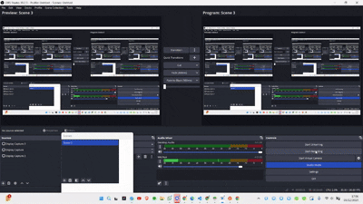

# Tugas 9 Praktikum Pemrograman Mobile 

## Identitas

Nama : Nabila Rizki Banati

NIM : H1D023086

Shift Awal : C

Shift Baru : D

## Deskripsi

Aplikasi ini adalah sistem manajemen inventaris untuk kategori bahan makanan di sebuah supermarket. Sistem ini membantu dalam pengelolaan stok barang, melacak tanggal masuk dan tanggal kadaluarsa, serta memudahkan proses pencatatan dan pemantauan inventaris secara digital.

## Penjelasan Aplikasi

Aplikasi ini dikembangkan menggunakan framework Flutter dengan backend API yang dibangun menggunakan CodeIgniter 4. Aplikasi menyediakan fitur lengkap untuk manajemen inventaris barang kategori bahan makanan, termasuk autentikasi pengguna, serta operasi CRUD (Create, Read, Update, Delete) untuk data barang.

## Video Demo Aplikasi

Video demo aplikasi dapat diakses melalui link berikut:



Video demo menunjukkan seluruh alur aplikasi mulai dari:
- Proses registrasi pengguna baru
- Proses login dengan kredensial yang valid
- Penambahan barang baru ke dalam sistem
- Pengeditan data barang yang sudah ada
- Penghapusan barang dari sistem
- Proses logout dari aplikasi

---

## Spesifikasi API (API Spec)

### Registrasi
| Endpoint | `/registrasi` |
|---|---|
| Method | POST |
| Header | Content-type: application/json |
| Body | `{ "nama":"string", "email":"string", "password":"string" }` |
| Response | `{ "code":200, "status":"boolean", "data":"Registrasi Berhasil" }` |

### Login
| Endpoint | `/login` |
|---|---|
| Method | POST |
| Header | Content-type: application/json |
| Body | `{ "email":"string", "password":"string" }` |
| Response | `{ "code":200, "status":"boolean", "data":[{"token":"string", "user":{"id":"int", "email":"string"}}] }` |

### CRUD Barang
1. List Barang

| Endpoint | `/barang` |
|---|---|
| Method | GET |
| Header | Content-type: application/json |
| Body | - |
| Response | `{ "code":200, "status":"boolean", "data":[{"id":"int", "nama":"string", "harga":"int", "jumlah":"int", "tanggal_masuk":"string", "tanggal_kadaluarsa":"string"}] }` |

2. Lihat Barang

| Endpoint | `/barang/{id}` |
|---|---|
| Method | GET |
| Header | Content-type: application/json |
| Body | - |
| Response | `{ "code":200, "status":"boolean", "data":[{"id":"int", "nama":"string", "harga":"int", "jumlah":"int", "tanggal_masuk":"string", "tanggal_kadaluarsa":"string"}] }` |

3. Tambah Barang

| Endpoint | `/barang` |
|---|---|
| Method | POST |
| Header | Content-type: application/json |
| Body | `{"id":"int", "nama":"string", "harga":"int", "jumlah":"int", "tanggal_masuk":"string", "tanggal_kadaluarsa":"string"}` |
| Response | `{ "code":200, "status":"boolean", "data":[{"id":"int", "nama":"string", "harga":"int", "jumlah":"int", "tanggal_masuk":"string", "tanggal_kadaluarsa":"string"}] }` |

4. Ubah Barang

| Endpoint | `/barang/{id}` |
|---|---|
| Method | PUT |
| Header | Content-type: application/json |
| Body | `{"id":"int", "nama":"string", "harga":"int", "jumlah":"int", "tanggal_masuk":"string", "tanggal_kadaluarsa":"string"}` |
| Response | `{ "code":200, "status":"boolean", "data":[{"id":"int", "nama":"string", "harga":"int", "jumlah":"int", "tanggal_masuk":"string", "tanggal_kadaluarsa":"string"}] }` |

5. Hapus Barang

| Endpoint | `/barang/{id}` |
|---|---|
| Method | DELETE |
| Header | Content-type: application/json |
| Body | - |
| Response | `{ "code":200, "status":"boolean", "data":"Barang berhasil dihapus" }` |

---

## Penjelasan Kode

### 1. Entry Point Aplikasi (`lib/main.dart`)
Aplikasi dimulai dengan mengecek apakah user sudah login sebelumnya. Jika sudah login, akan langsung ke halaman barang, jika belum akan menuju halaman login.

```dart
void main() async {
  WidgetsFlutterBinding.ensureInitialized();
  final prefs = await SharedPreferences.getInstance();
  String? token = prefs.getString('token');
  runApp(MyApp(isLoggedIn: token != null));
}
```

Tema aplikasi menggunakan warna hijau sebagai warna utama untuk menampilkan identitas toko.

---

### 2. Model Data (`lib/model/barang.dart`)
Model barang digunakan untuk memparsing JSON response dari API menjadi object Dart.

```dart
class Barang {
  int id;
  String nama;
  int harga;
  int jumlah;
  String tanggalMasuk;
  String tanggalKadaluarsa;

  Barang({
    required this.id,
    required this.nama,
    required this.harga,
    required this.jumlah,
    required this.tanggalMasuk,
    required this.tanggalKadaluarsa,
  });

  factory Barang.fromJson(Map<String, dynamic> json) {
    return Barang(
      id: json['id'],
      nama: json['nama'],
      harga: json['harga'],
      jumlah: json['jumlah'],
      tanggalMasuk: json['tanggal_masuk'],
      tanggalKadaluarsa: json['tanggal_kadaluarsa'],
    );
  }
}
```

---

### 3. API Helper (`lib/helpers/api.dart`)
Helper ini menangani semua HTTP request ke backend dengan format JSON dan menambahkan Bearer token untuk autentikasi.

```dart
class Api {
  static Future<dynamic> post(String url, dynamic body) async {
    final token = await UserInfo.getToken();
    try {
      final response = await http.post(
        Uri.parse(url),
        headers: {
          'Content-Type': 'application/json',
          'Authorization': 'Bearer $token'
        },
        body: jsonEncode(body),
      );
      return response;
    } catch (e) {
      throw Exception('Failed to post data');
    }
  }
}
```

---

### 4. BLoC untuk Login (`lib/bloc/login_bloc.dart`)
BLoC ini menangani logika autentikasi user, termasuk validasi dan penyimpanan token.

```dart
class LoginBloc {
  static Future<bool> login(String email, String password) async {
    try {
      final response = await Api.post(ApiUrl.login, {
        'email': email,
        'password': password,
      });
      if (response.statusCode == 200) {
        var dataUser = jsonDecode(response.body)['data'][0];
        await UserInfo.setToken(dataUser['token']);
        await UserInfo.setUserID(dataUser['user']['id']);
        return true;
      }
      return false;
    } catch (e) {
      throw Exception('Login gagal');
    }
  }
}
```

---

### 5. BLoC untuk Barang (`lib/bloc/produk_bloc.dart`)
BLoC ini menangani operasi CRUD (Create, Read, Update, Delete) untuk data barang dari API.

```dart
class BarangBloc {
  static Future<List<Barang>> getBarang() async {
    try {
      final response = await Api.get(ApiUrl.barang);
      if (response.statusCode == 200) {
        var data = jsonDecode(response.body)['data'] as List;
        return data.map((e) => Barang.fromJson(e)).toList();
      }
      throw Exception('Failed to load barang');
    } catch (e) {
      throw Exception(e.toString());
    }
  }

  static Future<bool> addBarang(Barang barang) async {
    try {
      final response = await Api.post(ApiUrl.barang, {
        'nama': barang.nama,
        'harga': barang.harga,
        'jumlah': barang.jumlah,
        'tanggal_masuk': barang.tanggalMasuk,
        'tanggal_kadaluarsa': barang.tanggalKadaluarsa,
      });
      return response.statusCode == 200;
    } catch (e) {
      throw Exception(e.toString());
    }
  }
}
```

---

### 6. Halaman Login (`lib/ui/login_page.dart`)
Halaman login dengan form validasi email dan password sebelum dikirim ke BLoC.

```dart
void _submit() async {
  if (_formKey.currentState!.validate()) {
    try {
      bool isLogged = await LoginBloc.login(
        _emailController.text,
        _passwordController.text,
      );
      if (isLogged) {
        Navigator.pushReplacementNamed(context, '/barang');
      }
    } catch (e) {
      showDialog(
        context: context,
        builder: (context) => WarningDialog(description: e.toString()),
      );
    }
  }
}
```

---

### 7. Halaman Daftar Barang (`lib/ui/barang_page.dart`)
Menampilkan list barang dari API menggunakan FutureBuilder dan menyediakan opsi tambah barang melalui FAB (Floating Action Button).

```dart
@override
Widget build(BuildContext context) {
  return FutureBuilder<List<Barang>>(
    future: BarangBloc.getBarang(),
    builder: (context, snapshot) {
      if (snapshot.connectionState == ConnectionState.done) {
        if (snapshot.hasError) {
          return Center(child: Text('Error: ${snapshot.error}'));
        }
        return ListView.builder(
          itemCount: snapshot.data?.length ?? 0,
          itemBuilder: (context, index) {
            return ListTile(
              title: Text(snapshot.data![index].nama),
              subtitle: Text('Rp${snapshot.data![index].harga}'),
              onTap: () {
                Navigator.pushNamed(context, '/barang/detail',
                    arguments: snapshot.data![index]);
              },
            );
          },
        );
      }
      return Center(child: CircularProgressIndicator());
    },
  );
}
```

---

### 8. Form Input Barang (`lib/ui/barang_form.dart`)
Form untuk tambah atau edit barang dengan validasi field dan submit ke API.

```dart
void _simpan() async {
  if (_formKey.currentState!.validate()) {
    var barang = Barang(
      id: 0,
      nama: _namaController.text,
      harga: int.parse(_hargaController.text),
      jumlah: int.parse(_jumlahController.text),
      tanggalMasuk: _tanggalMasukController.text,
      tanggalKadaluarsa: _tanggalKadaluarsaController.text,
    );
    try {
      bool result = await BarangBloc.addBarang(barang);
      if (result) {
        showDialog(
          context: context,
          builder: (_) => SuccessDialog(description: 'Barang berhasil ditambahkan'),
        );
      }
    } catch (e) {
      showDialog(context: context, builder: (_) => WarningDialog(description: e.toString()));
    }
  }
}
```

---

### 9. Dialog Custom (`lib/widget/success_dialog.dart` dan `warning_dialog.dart`)
Widget untuk menampilkan pesan sukses atau error kepada user.

```dart
class SuccessDialog extends StatelessWidget {
  final String description;
  
  const SuccessDialog({required this.description});

  @override
  Widget build(BuildContext context) {
    return AlertDialog(
      content: SingleChildScrollView(
        child: ListBody(
          children: [
            Text('Sukses!'),
            SizedBox(height: 10),
            Text(description),
          ],
        ),
      ),
      actions: [
        TextButton(
          onPressed: () => Navigator.pop(context),
          child: Text('OK'),
        ),
      ],
    );
  }
}
```

---

### 10. Penyimpanan Data User (`lib/helpers/user_info.dart`)
Helper untuk menyimpan dan mengambil informasi user dari SharedPreferences secara lokal.

```dart
class UserInfo {
  static const String _tokenKey = 'token';
  static const String _userIdKey = 'userId';

  static Future<void> setToken(String token) async {
    final prefs = await SharedPreferences.getInstance();
    await prefs.setString(_tokenKey, token);
  }

  static Future<String?> getToken() async {
    final prefs = await SharedPreferences.getInstance();
    return prefs.getString(_tokenKey);
  }

  static Future<void> logout() async {
    final prefs = await SharedPreferences.getInstance();
    await prefs.clear();
  }
}
```
